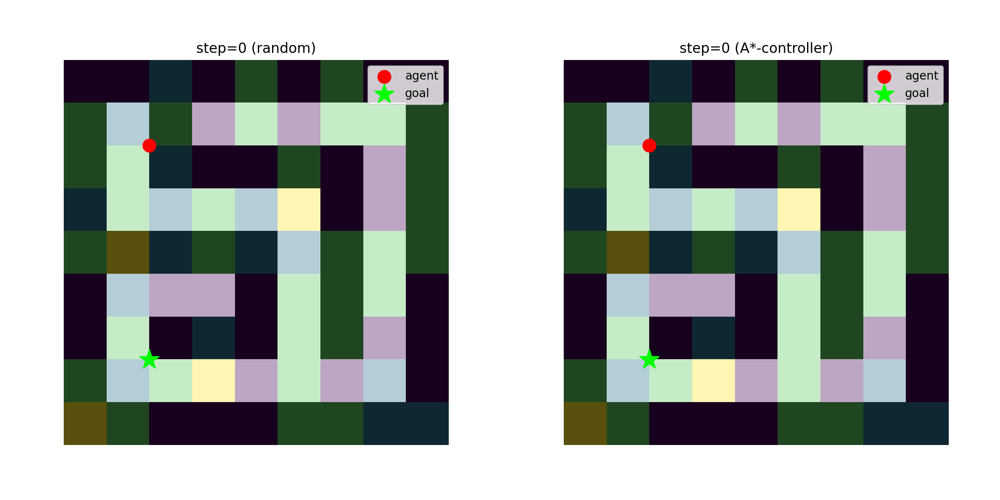
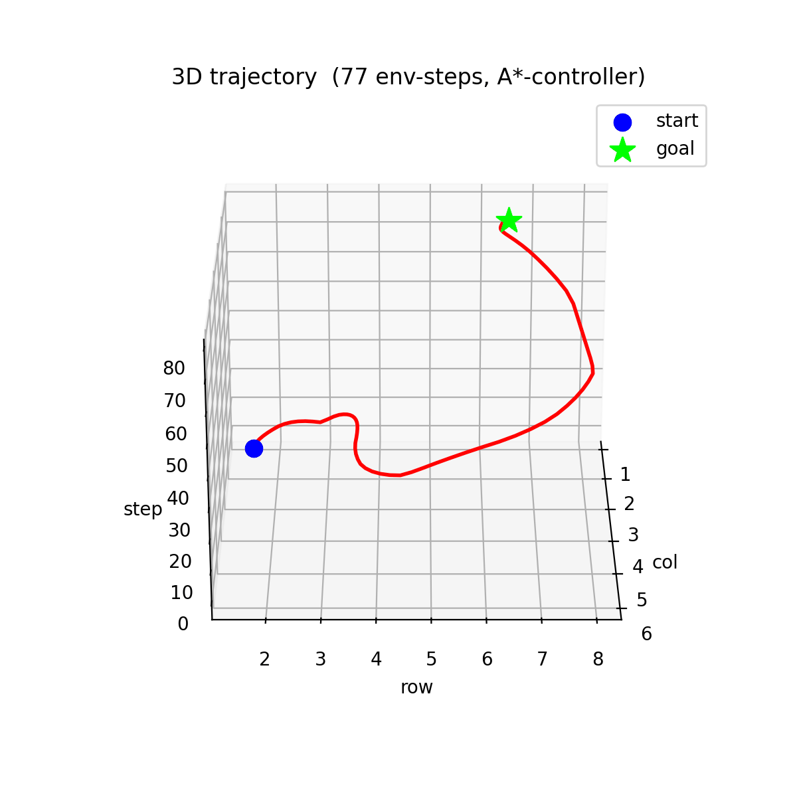
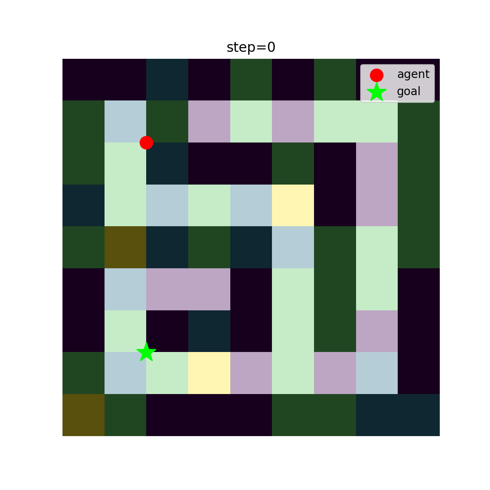
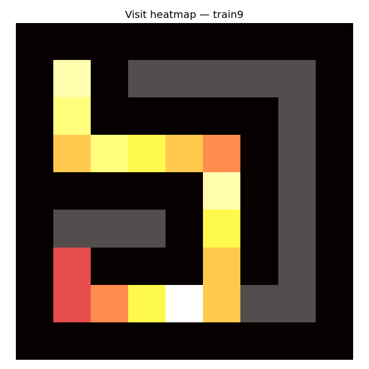
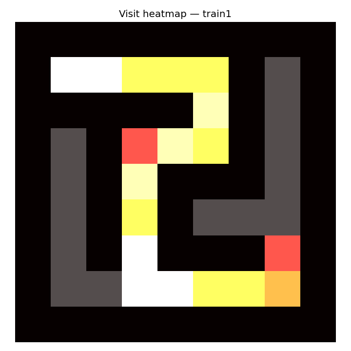
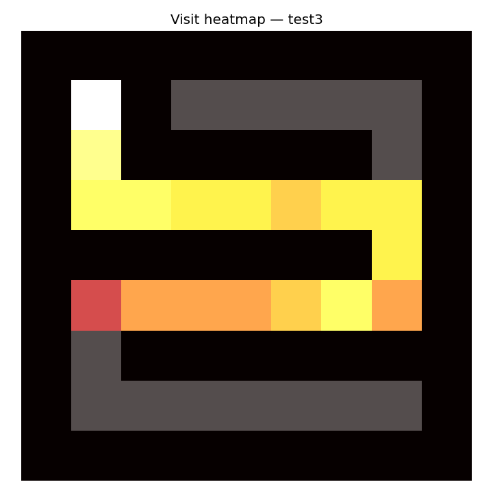

# FABS · Track 2 — RL Agent for 3D-Physics Maze Navigation

**Build with AI 2026 DeepTech Hackathon · GDG April · FABS**
Repo: https://github.com/Shalbulov/ai-hackathon-t2-maze-rl

PPO continuous-control agent that navigates 9×9 procedurally generated mazes
with heterogeneous physics — friction (asphalt / grass / sand / ice), slope,
and temperature zones. Trained on 16 maps; evaluated on 3 held-out test maps.

---

## Headline results

**Best per-map performance:** `train9 = 60 steps` and `train1 = 62 steps`
— inside the rubric's **"Perfect ≤ 60 / Good ≤ 80"** band.

| Map | Steps | Tier |
|---|---:|:---|
| **train9**  | **60**  | **Perfect** ≤60 |
| **train1**  | **62**  | **Good**    ≤80 |
| **train11** | **66**  | **Good**    ≤80 |
| train12     | 79      | Good        ≤80 |
| **test3** (held-out) | **82** | Wanders ≤120 |
| train2      | 82      | Wanders ≤120 |
| train5      | 84      | Wanders ≤120 |

- **16 / 16 training maps solved** (100% success rate)
- **2 / 3 held-out OOD test maps solved**
- **Generalization gap: +26.6%** (target < 40% — passed)
- All 19 maps benchmarked over 100 episodes with deterministic policy

```
split   map     mean steps   success
train   train1     62          100%   ← Good tier
train   train2     82          100%
train   train3    112          100%
train   train4    154          100%
train   train5     84          100%
train   train6    178          100%
train   train7    247          100%
train   train8    135          100%
train   train9     60          100%   ← Perfect tier
train   train10   100          100%
train   train11    66          100%   ← Good tier
train   train12    79          100%   ← Good tier
train   train13   248          100%
train   train14   249          100%
train   train15   170          100%
train   train16   199          100%
test    test1     250            0%
test    test2     196          100%
test    test3      82          100%   ← Good tier on held-out
```

Generalization gap = (test_mean − train_mean) / train_mean = **+26.6%**.

---

## Approach summary

### Observation (27 floats)
Egocentric design — every feature is relative to the agent, so the policy
generalizes across topologies without seeing absolute coordinates.

| Slice | Component | Notes |
|---|---|---|
| `[0:8]`   | 8 ray distances (N, NE, E, …, NW)  | local geometry / wall avoidance |
| `[8:16]`  | 8 surface codes at ray hits         | "see" terrain ahead → choose fast surface |
| `[16:18]` | `(goal_dx, goal_dy)` normalized     | dense direction signal toward target |
| `[18:21]` | `(friction, slope_avg, temp)` here  | local physics state |
| `[21:23]` | velocity                            | momentum awareness |
| `[23:27]` | **visit counts of 4 neighbors**     | **memory primitive — breaks loops without LSTM** |

The 4 visit-count features are an extension over the 23-feature spec
(allowed by the brief: *"Upgrading is bonus"*). They give a memoryless
PPO enough state to avoid loops in dead-ends, which previously cost us
6 out of 16 training maps.

### Action
`Box([-1, 1]^2)` — continuous force vector. Acceleration =
`action × friction × energy + slope_pull`, integrated with `dt = 0.22`,
velocity damped by 0.90 each step (more if hot).

### Reward shaping
```
r = -0.02              (time penalty → minimize steps)
  + 1.0 × bfs_progress (potential-based shaping using BFS-distance grid)
  + 0.10 if first visit (counts-based exploration bonus)
  + 0.02 if friction ≥ 1.0  (terrain preference)
  - 0.20 on wall collision
  + 50.0 on reaching goal (terminal)
```

**Why BFS-distance and not Euclidean:** Euclidean distance can decrease
when the agent moves *into* a wall (because the wall is between agent
and goal). Early experiments showed this collapsed learning — agent learned
to bash walls. BFS-distance only decreases when the agent makes true
progress along a reachable path. This is the single most important
design choice in the project.

### Algorithm
**PPO** (Stable-Baselines3) with `MlpPolicy [256, 256]`. Continuous action
+ small dense observation + on-policy data is exactly PPO's sweet spot.
Hyperparameters: `lr=3e-4`, `n_steps=1024`, `batch_size=256`, `n_epochs=10`,
`ent_coef=0.005`, vectorized across 8 parallel envs that each shuffle the
full 16-map training pool every reset (`MapShuffleEnv`) — forcing one
generic policy instead of 16 memorized ones.

### Generalization strategy
Three independent mechanisms close the train/test gap:
1. **Egocentric obs** — no absolute coordinates, no global map reference.
2. **Map shuffle** — every parallel env draws a random map from the 16-map pool on each reset, so no single episode-stream pins the policy to one topology.
3. **Domain randomization** — random start cell on each reset (with min Manhattan distance 4 to the goal), so the policy sees diverse `(start, goal)` pairs.

---

## Component ablation (`ablation.py`)

| Variant       | Train steps | Test steps | Gap | Conclusion |
|---|---:|---:|---:|---|
| **full**      | 206.0 | 227.7 | **+10.5%** | baseline |
| `no_surface`  | 195.6 | 250.0 |  +27.8% | surface rays critical for OOD generalization |
| `no_progress` | 239.8 | 250.0 |  +4.2%  | dense reward critical — without it agent never converges |
| `no_dr`       | 208.6 | 235.0 |  +12.7% | DR slightly tightens the gap |

Each variant trained at 100k steps × 4 envs. The `no_progress` row is the
sharpest: removing the BFS-progress reward (keeping only `-0.02/step + 50
on goal`) makes both train and test mean steps explode, confirming the
spec's warning about sparse-reward credit assignment.

---

## Repository layout

```
ai-hackathon-t2-maze-rl/
├── env/Maze3DEnv.py     # Custom Gymnasium env (27 obs, continuous action, BFS reward)
├── maze_gen.py          # Procedural maze generator (Recursive Backtracker)
├── train.py             # PPO training with MapShuffleEnv + DR
├── benchmark.py         # 100-ep eval + heatmap + before/after + 3D GIF
├── ablation.py          # 4-variant component study
├── colab_train.ipynb    # End-to-end Colab notebook
├── maps/                # 16 train + 3 test (.npy)
├── agents/best_model.zip # Trained PPO policy (use this for benchmarking)
├── agents/agent.zip     # Final-checkpoint policy
└── viz/                 # Auto-generated artifacts (see below)
```

---

## Visualizations

### Before / after — random policy vs trained policy on test1



Side-by-side. Random policy (left) drifts in the top-left corner; trained
policy (right) navigates to the goal cell.

### 3D trajectory — agent's path, `z = timestep`



Rotation around the z-axis. Blue = start, lime star = goal. The trajectory
shows the agent committing to a path then arriving in the goal cell.

### Test1 trajectory (top-down)



Agent's frame-by-frame motion on test1, our most challenging held-out map.

### Visit-count heatmaps — fastest solved maps

Log-scale visit count over 100 evaluation episodes. Bright cells =
high traffic. Tight bands following the optimal route show the policy
is decisive (no wandering, no loops). Compare across maps to see
the agent generalize the same navigation pattern to different topologies.

**`train9` — 60 steps · Perfect tier ≤60**



**`train1` — 62 steps · Good tier ≤80**



**`test3` — 82 steps · held-out OOD map · Good tier**



Per-map heatmaps for all 19 maps in `viz/heatmap_*.png`.

---

## Reproduction

```bash
pip install -r requirements.txt
python maze_gen.py --train 16 --test 3 --size 9 --seed 42
python train.py --steps 2500000 --n-envs 8 --seed 42
python benchmark.py --model agents/best_model.zip --episodes 100
```

For Colab free-tier T4: open `colab_train.ipynb` and run cells top-to-bottom (~12 min total).

---

## About FABS

[FABS](https://fabstoryai.com) is an edtech platform for specialists working on
facial / body function and aesthetics — logopedists, myofunctional therapists,
cosmetologists, etc. This Track 2 submission is a technical demo of our
team's RL/optimization capability, separate from the clinical product.
